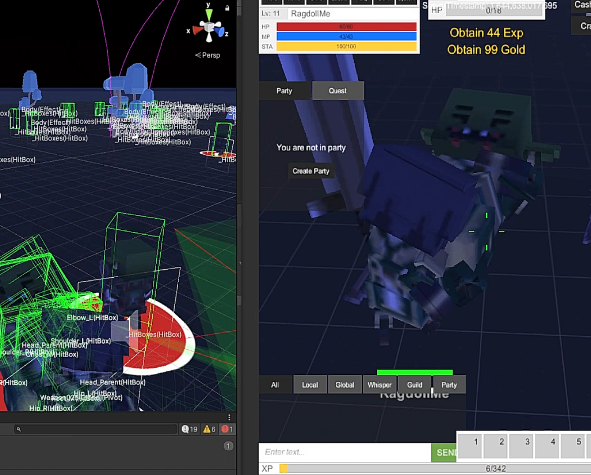
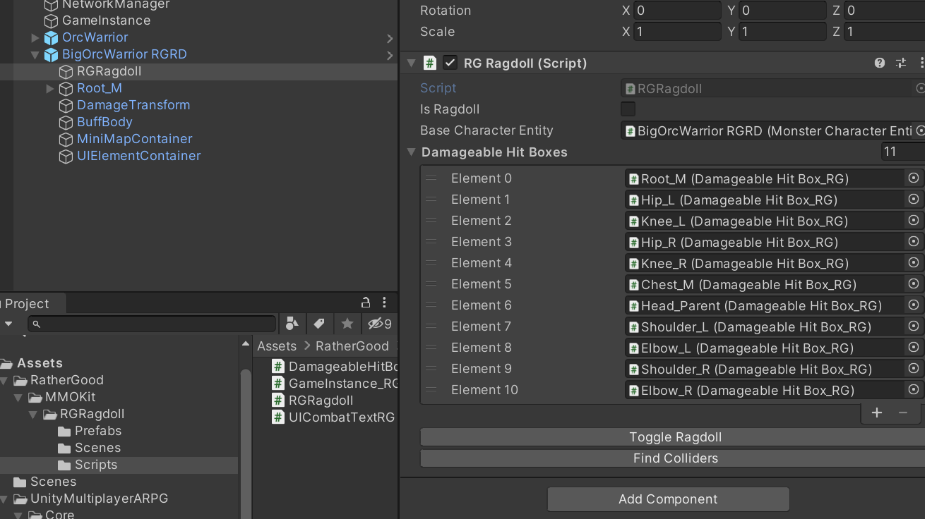
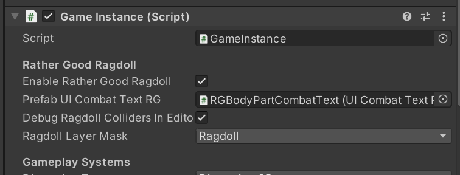

# RGRagdoll

**Credits**: Thank you https://github.com/denariigames for multiplayer damage text example.

**Author:** RatherGood1

**Version**: 0.4

This is a working demo. Not tested in MMO mode. Check back often for further change/improvements.

**Updated:** 4 Apr 22

V0.4 
* Fixes damage text in multiplayer mode.
* syncs utils directory with other RG mods

V0.3
* fixes layers player/monster. 
* Fixes raycast atatcks (melee/guns etc...) resetting entity transform when attacking ragdoll.  
* Adds player ragdoll example. (Use Male_CC_RGRG) in place of Male_CC

V0.2 few fixes. Changes to RGRagdoll script

**Compatibility:** Tested on Suriyun MMORPG Kit Version 1.73c and Unity 2021.1.23f1 (2020.3.XX)

**Core MMORPG Kit modifications:** None

**Description:** Monster entities ragdoll on death, or others probably.

**Demo Video:**

**Other Dependencies:**

None. Uses standard unity ragdoll creator.

**QUICK START:**

See example "BigOrcWarrior RGRD"

Use standard Unity ragdoll creator "GameObject > 3D Object > Ragdoll"

Add child gameObject and RGRagdoll script.

Click "Find Colliders" button that will add DamageableHitBox_RG.cs script to each joing rigidBody.  Set the body part enum manually if you want combat text to display the body part text hit in combat.

See the GameInstance for other settings.  Create and assign a seperate ragdoll layer for the ragdoll body parts seperate from the characterLayer.

**Done.**

